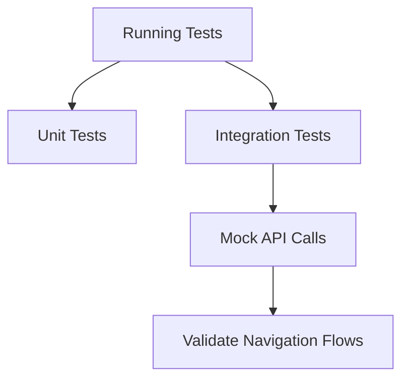
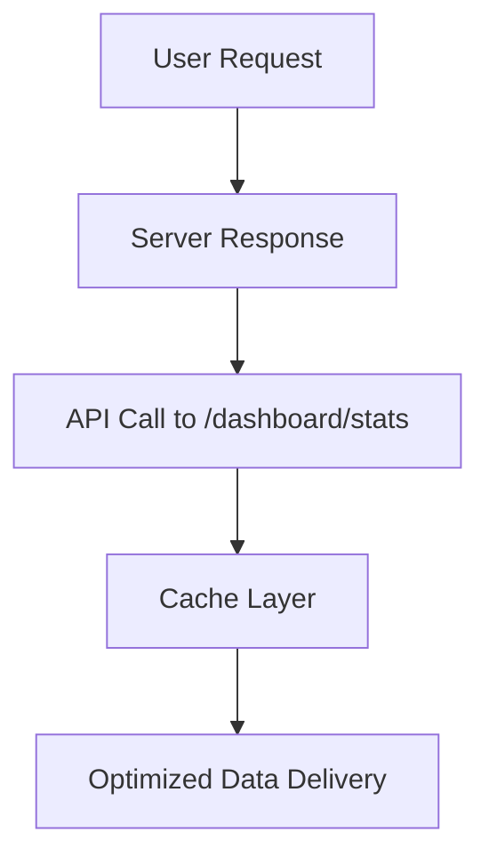
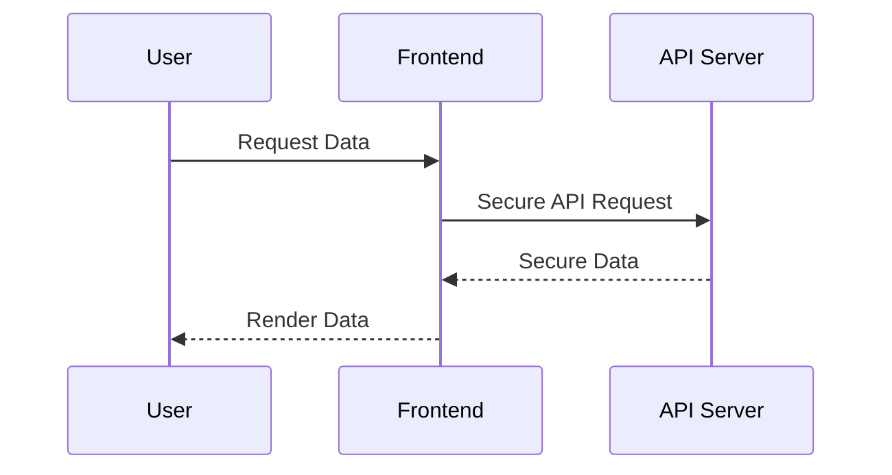
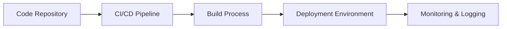

# Production Readiness Plan

This document outlines a detailed plan to prepare the code for production. It covers areas such as code quality, performance, security, testing, documentation, and deployment. Refer to the links below for specific implementation details in the code. For example, the [DashboardHome.js](frontend/src/components/dashboard/DashboardHome.js) contains critical UI components of the dashboard.

---

## 1. Overview

The project is a React-based frontend application using Material-UI and several third-party libraries (e.g., axios, @nivo/pie, MUI/x-date-pickers). To deliver a production-ready product, the following steps and guidelines will be implemented:

- **Code Quality & Consistency**
- **Testing & Validation**
- **Performance Optimization**
- **Security Hardening**
- **Deployment & Monitoring**
- **Documentation & Maintenance**

---

## 2. Code Quality & Consistency

- **Linting & Formatting:**  
  Ensure all files pass ESLint/TSLint rules and Prettier formatting checks.  
  **Action:**  
  - Integrate ESLint into your CI/CD pipeline.
  - Use Prettier for consistent code style.
  - Add pre-commit hooks (using Husky) to enforce rules.

- **Modularization & Reusability:**  
  Ensure components (e.g., StatCard, QuickActions in [DashboardHome.js](frontend/src/components/dashboard/DashboardHome.js)) are modular. Refactor repeated code where necessary.

- **Type Checking:**  
  Use PropTypes or TypeScript to catch type errors at compile time.

---

## 3. Testing & Validation

- **Unit Tests:**  
  Add unit tests for each React component (using Jest and React Testing Library).  
  **Examples:**  
  - Test that `DashboardHome` correctly renders the statistics.
  - Test API error handling in the useEffect hooks.

- **Integration / End-to-End Tests:**  
  Consider Cypress or Selenium to validate routing and workflow (e.g., dashboard navigation).

- **Mock API Responses:**  
  Use tools like msw (Mock Service Worker) to simulate backend responses during testing.

- **Example Test Graph:**

---

## 4. Performance Optimization

- **Code Splitting & Lazy Loading:**  
  Implement code splitting using React.lazy or dynamic imports to reduce initial load times.

- **Caching API Responses:**  
  Use service workers or caching mechanisms (e.g., SWR, React Query) to cache data from calls like `/api/dashboard/stats` and `/api/appointments/recent`.

- **Asset Optimization:**  
  - Minify CSS and JS files with tools like Esbuild or Webpack.
  - Optimize images and use an appropriate image format.

- **Graphical Overview:**

---

## 5. Security Hardening

- **API Security:**  
  Ensure secure API endpoints. Validate data on both client and server sides.  
  **Action Steps:**
  - Sanitize inputs.
  - Implement proper authentication and authorization.

- **Dependencies Audit:**  
  Regularly run tools like npm audit or Snyk to check for vulnerabilities.

- **HTTPS & Content Security Policy:**  
  Deploy the site over HTTPS. Configure a strict Content Security Policy (CSP) to mitigate XSS and data injection.

- **Security Workflow Diagram:**

---

## 6. Deployment & Monitoring

- **Build Pipeline:**  
  Set up a CI/CD pipeline (e.g., GitHub Actions, GitLab CI) that runs:
  - Linting and unit tests.
  - Production build using `npm run build` (or similar command).

- **Environment Configuration:**  
  Manage different environments (development, staging, production) with environment variables.

- **Deployment Tools:**  
  Use Docker, Kubernetes, or platform-specific deployments (Netlify, Vercel) for continuous deployment.

- **Monitoring & Logging:**  
  - Integrate logging (e.g., Sentry for error tracking).
  - Set up performance monitoring (e.g., New Relic, Prometheus).

- **Deployment Diagram:**

---

## 7. Documentation & Maintenance

- **Code Documentation:**  
  Maintain inline comments and a separate developer guide.
  
- **Feature Documentation:**  
  Update the documentation when features change. Use Mermaid diagrams, flowcharts, and detailed descriptions.

- **Maintenance Plan:**  
  - Schedule periodic code reviews.
  - Regularly update dependencies.
  - Create backup and disaster recovery plans.

---

## 8. Roadmap Summary

1. **Code Quality:**  
   - Integrate ESLint, Prettier, and TypeScript.
   - Refactor redundant logic in key components ([DashboardHome.js](frontend/src/components/dashboard/DashboardHome.js)).

2. **Testing:**  
   - Write unit and integration tests.
   - Use Mock Service Worker for API testing.

3. **Performance:**  
   - Implement lazy loading and caching.
   - Optimize assets and API response times.

4. **Security:**  
   - Harden API endpoints.
   - Audit dependencies and enforce HTTPS/CSP policies.

5. **Deployment:**  
   - Establish a robust CI/CD pipeline.
   - Set up monitoring solutions and environment-specific configurations.

6. **Documentation:**  
   - Write comprehensive developer and user guides.
   - Maintain diagrams and process flows.

---

## 9. Conclusion

Following this plan will ensure the system is robust, secure, and performant in a production environment. Regular reviews, automated tests, and monitoring will help maintain a high standard of quality throughout the lifetime of the project.

---

*For any questions or further clarifications, please update the documentation or contact the development team.*